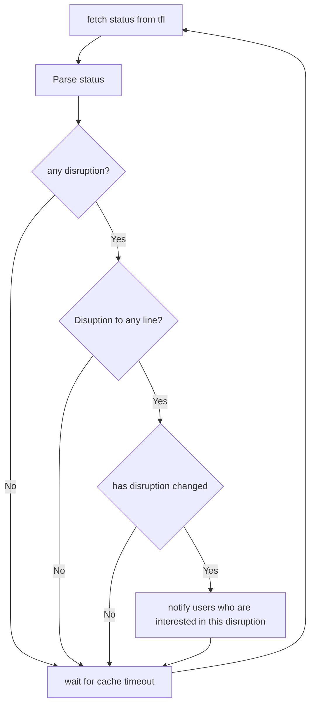
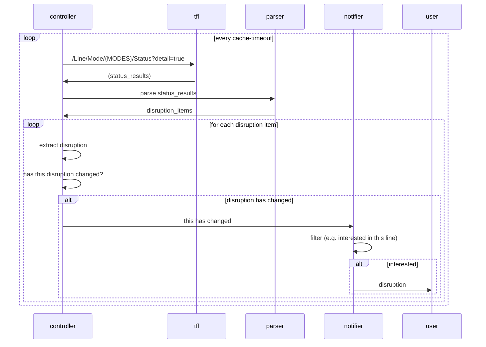

# diagrams explaining how the service works

```mermaid

flowchart TD
    A[fetch status from tfl] -->B[Parse status]
    B-->C{any disruption?}
    C-- No -->D[wait for cache timeout]
    D-->A
    C-- Yes -->E{Disuption to any line?}
    E-- No --> D
    E-- Yes -->F{has disruption changed}
    F-- No -->D
    F-- Yes -->G[notify users who are interested in this disruption]
    G-->D

```

```mermaid
sequenceDiagram
    loop every cache-timeout
        controller->>+tfl: /Line/Mode/{MODES}/Status?detail=true
        tfl->>controller: (status_results)
        controller->>parser: parse status_results
        parser->>controller: disruption_items

        loop for each disruption item
            controller->>controller: extract disruption
            controller->>controller: has this disruption changed?
            alt disruption has changed
                controller->>notifier: this has changed
                notifier->>notifier: filter (e.g. interested in this line)
                alt interested
                    notifier->>user: disruption
                end
            end
        end
    end

```
  